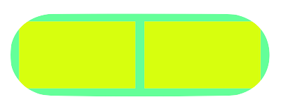

# MBRoundRectView

This is UIView allow you create rounded rect corner for your at any potion like top left, bottom left, top right, bottom right.

    

## Installation

### CocoaPods

[CocoaPods](http://cocoapods.org) is a dependency manager for Cocoa projects. You can install it with the following command:

```bash
$ gem install cocoapods
```

To integrate *** MBRoundRectView*** into your Xcode project using CocoaPods, specify it in your `Podfile`:

```ruby
target '<Your Target Name>' do
    pod 'MBRoundRectView'
end
```

Then, run the following command:

```bash
$ pod install
```

##How to Use

It is very simple and easy to use. It is designed in such way that you can view the actual layout in XIB itself. You can make all or any corner as round rect in XIB itself. Just assign *[MBRoundRectView](Source/MBRoundRectView.swift)* to your view and you are ready to use it.

  


##Licence

**[MIT](LICENSE)**
